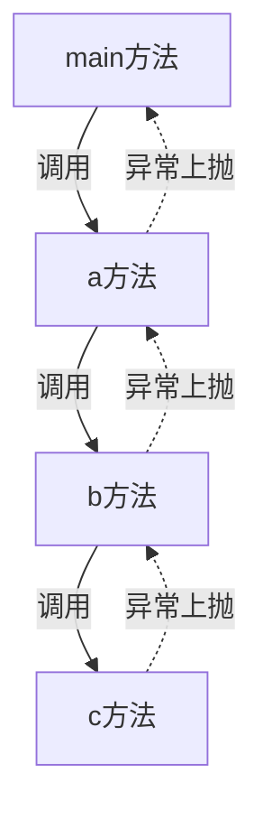

# 第四次课件-面向对象复习与进阶

> 这节课的有些知识相对比较难，并且都是日常开发中不太常用到但有必要了解的知识。某些地方如果听不懂下来搞不明白可以不用死磕，毕竟来日方长，以后用到了再去了解也是可以的。

## 异常处理

我们的程序即便通过了编译，但依然可能会出现各种各样的错误。比如`1 / 0`这个操作是可以通过编译的，但实际运行时就会出现错误：因为0不能作为分母；还有老生常谈的数组越界的问题，一旦我们在获取/设置数组的内容时指定的下标超出了数组的大小范围，也会出现错误。这时候我们程序的做法是什么呢？那就是抛出一个异常（Exception），这个异常一旦没有得到妥善的处理，程序就会退出。而在我们android应用开发中就表现为app闪退，这肯定是非常影响体验的。

### 什么是异常

> 异常是导致程序中断的一种指令流，如果不对异常进行正确的处理，则可能导致程序中断运行

而在java中异常有一个统一的父类，它就是`Throwable`（可抛出的）。而往下又可以细分出两个类型`Exception`, `Error`。


Exception对应java应用程序抛出的异常（也就是我们要处理的异常），而Error则对应着来自jvm的异常（通常我们是无法处理的）。

### 异常的抛出与捕获

#### 抛出

那么假如我们的程序走到了一个不应该走到的地方，我们要怎么抛出一个异常呢？

```java
if (2 + 2 == 4) {
    System.out.println("所谓自由就是可以说2+2=4的自由");
} else {
    // 正常情况下不可能走到这条分支，走到这里就说明前面肯定出现了bug，我们直接抛出异常让程序终止
    throw new RuntimeException("2 + 2 != 4");
}
```

使用`throw`关键字去抛出一个Exception对象即可，我们这里直接new一个`RuntimeException`对象，平时我们需要抛出异常的时候一般使用它就够了。

而在某些情况下，抛出异常是为了让编译器通过编译。

```java
public static String get() {
    if (2 + 2 == 4) {
        return "所谓自由就是可以说2+2=4的自由";
    }
    // 虽然程序不可能走到这里，但这里如果不返回一个值的话就无法通过编译
    // 如果我们在这里抛出异常，程序就能直接通过编译
    throw new RuntimeException("2 + 2 != 4");
}
```

那么是不是一旦抛出异常就会立即崩溃呢？并不会，异常会顺着方法的调用栈向下层传递，并且在传递到调用栈的最底部时令程序崩溃。

举个例子

```java
public static void main(String[] args) throws RuntimeException {
    a();
}

public static void a() {
    b();
}

public static void b() {
    c();
}

public static void c() {
    throw new RuntimeException("程序执行错误!");
}
```



main方法上层没有调用者了，位于调用栈的最顶点，所以程序直接异常退出。

> 所以抛出异常也有清理方法调用栈的作用

#### 捕获

为什么java的异常机制要设计为层层上抛？难道不能抛出就直接崩溃吗？

那就涉及到我们的异常处理机制了，因为要给开发者捕获异常的机会。我们先来看看java中如何捕获异常

```java
public static void main(String[] args) throws RuntimeException {
    try {
        a();
    } catch (Exception e) {
        System.out.println("嘿嘿，异常被捕获啦！");
    }
    System.out.println("程序的执行并没有中断哦！");
}
```

我们将`a()`的调用包裹在了try catch块中，所以当异常从a()上抛到main()方法时异常被拦截并捕获到了catch块的逻辑中，在catch块中我们拿到了这个异常的对象并且执行了对应的异常处理逻辑。并且由于异常没有上抛到main()方法的上一级，程序并没有退出，而是继续执行了下面的逻辑。

并且我们也可以在catch中指定想要捕获的异常类型，且catch是可以有多个的

```java
public static void main(String[] args) throws RuntimeException {
    try {
        int i = 1 / 0;
    } catch (ArithmeticException e) {
        System.out.println("捕获了一个ArithmeticException");
    } catch (Exception e) {
        System.out.println("产生了ArithmeticException以外的异常，将其重新抛出");
        throw e;
    }
    System.out.println("程序的执行并没有中断哦！");
}
```

可以把这种语法看作

~~~java
// 上面捕获到异常e
if (e instanceof ArithmeticException) {
    System.out.println("捕获了一个ArithmeticException");
} else if (e instanceof Exception) {
    System.out.println("产生了ArithmeticException以外的异常，将其重新抛出");
    throw e;
}
~~~

其实本质上就是if else if罢了。

### 自定义异常类型

只需要继承Exception就可以了

给个`CrazyThursdayException`的例子

```java
public class CrazyThursdayException extends Exception {
    public CrazyThursdayException() {
        super("KFC CRAZY THURSDAY 50$ required");
    }

    public static void main(String[] args) throws CrazyThursdayException {
        throw new CrazyThursdayException();
    }
}
```

效果:


### 断言

```java
assert 2 + 2 == 4;
```

断言后面可以跟一段返回布尔值的表达式，如果为true就继续往下执行，不为true就抛出一个断言失败的异常。

其实用法没啥稀奇的，断言一般在单元测试中使用，业务逻辑中一般不会出现断言。

## 泛型

### 为什么我们需要泛型？

就拿我们之前的作业来说吧，第二次作业的Level5我们要求自己实现一个`ArrayList`。用过的同学应该就知道，这东西比数组可是好用太多了，它的长度是可变的。但它的写法与数组有一点小区别。我们知道`String[]`是一个String类型的数组，其中每一个元素都是String类型的元素，相同的，我们也知道`int[]`是一个整型数组。那ArrayList呢？作为一个class定义的引用类型，它有没有办法知道它里面装的是什么类型的元素呢？

在泛型被引入到java之前，这个答案是否定的。

```java
public static void main(String[] args) {
    ArrayList list = new ArrayList();
    list.add(1);
    list.add(2);
    list.add("123");
    int num = (int) list.get(0);
}
```

我们会注意到add方法的参数类型是`Object`，且get方法返回的类型也是`Object`，这意味着我们可以将任意类型的元素放到ArrayList中，并且取出来也是一个Object类型的元素，需要我们手动进行强制转换。

那么在实际的开发场景中，我们拿到一个`ArrayList`很有可能根本不知道里面装的是什么类型的元素，更要命的是每个参数的类型都有可能不一样。就算我们不在意这些，每次获取元素时都要进行一次强制转换实在是有些麻烦并且不太优雅的行为。怎么样，是不是瞬间感觉还不如数组好用了？

于是聪明的你想到了一个好方法，我专门封装一个存Int类型的`ArrayList`不就好了？

```java
public class IntArrayList {
    private ArrayList internalArrayList = new ArrayList();

    public int getInt(int index) {
        return (int) internalArrayList.get(index);
    }

    public void addInt(int index) {
        internalArrayList.add(index);
    }
}
```

这样是解了燃眉之急，但我们在业务中需要使用ArrayList来存储的类型可不只Int，难道每个类型我们都要为其封装一个XXXArrayList吗？这样就需要写很多重复代码，严重拖慢了开发效率。

### 什么是泛型

泛型的出现解决了这个问题，泛型说白了就是**类型参数**，也就是一个类型被允许有多个未知的参数（既然是类型附带的参数，这些参数当然也是类型）。以上面的问题为例，我们可以让ArrayList带一个类型参数E，这个E可以是任何引用类型，在我们使用它的时候才需要指定它的具体类型。然后我们令get方法的返回值类型和add方法的参数类型为E。我们在使用它的时候就只需要传入我们需要传入的类型参数就可以得到存储对应类型元素的ArrayList。使用了泛型后只需要写一个类就可以适应之前需要写很多类的情况，大大的提高了开发效率，属于是资本家狂喜了。

纸上得来终觉浅，觉知此事要躬行。看看下面的使用例子想必你们就能明白了。

### 泛型的使用

#### 类泛型

类泛型顾名思义就是依托于类存在的类型参数。一旦我们在定义一个类时使用了类泛型，在之后我们每次使用这个类时都需要指定类型参数。先看看我们如何使用类泛型来解决上面的问题。

```java
public class GenericArrayList<E> {
    private ArrayList internalArrayList = new ArrayList();

    public E get(int index) {
        return (E) internalArrayList.get(index);
    }

    public void add(E element) {
        internalArrayList.add(element);
    }

    public static void main(String[] args) {
        // 用于存放字符串的arrayList 将泛型指定为String
        GenericArrayList<String> stringGenericArrayList = new GenericArrayList<String>();
        // 只能放入String类型元素
        stringGenericArrayList.add("Hello world");
        // 放入其他类型元素会报错
        // stringGenericArrayList.add(1);
        // 取出来也直接是String类型
        String element = stringGenericArrayList.get(0);
        // 用于存放整数的arrayList
        // 一旦类型可以被推导出来，创建带有泛型的类的对象时<>中的东西就可以被省略，这是java7带给我们的语法糖
        GenericArrayList<Integer> integerGenericArrayList = new GenericArrayList<>();
    }
}
```

当然，在泛型诞生之后其实ArrayList就一直自带泛型了，所以我们日常使用只需要使用带泛型的ArrayList就可以解决这个问题，这里为了讲解故意没有使用ArrayList的泛型。

看，我们在声明类的时候给类名后面带了个小尾巴`<E>`，这个东西就是这个类的类泛型，在我们声明类时它是不确定的，而在我们使用这个类时就必须指定出来。

指定了类泛型之后我们就可以在类中将其作为一种类型来使用，可以指定为成员的类型，也可以将其作为方法的参数或返回值的类型。

```java
public class GenericClazz<T> {
    
    private T element;
    
    public T get() {
        return this.element;
    }
    
    public void set(T element) {
        this.element = element;
    }
    
}
```

当然一个类也可以指定多个泛型，且泛型的名称是可以随便取的（规范是全大写字母且尽可能简洁）

```java
public class MultiGeneric<T, E> {
    // ...
}
```

当然，他们自然也可以在接口/抽象类中使用。

```java
public interface GenericInterface<T> {
    // ...
}
```

##### 类泛型与多态

上文中我们提到接口与抽象类也可以使用类泛型，那么问题就来了，泛型类被继承/实现的时候泛型应该如何处理呢？

```java
public interface GenericInterface<T> {
    // ...
}

// 被继承/实现的类型必须要填入具体的类型参数
// 但我们可以在子类/实现类定义一个泛型，再将其填入被继承/实现类的泛型中去，实现泛型类型的继承
class GenericInterfaceImpl<T> implements GenericInterface<T> {
    
}

// 当然也可以填入一个具体的类型
class GenericInterfaceStringImpl implements GenericInterface<String> {
    
}
```

被继承或实现的类型必须填入具体的类型参数，但这个参数可以是子类/实现类定义的泛型类型，以此可以实现未知类型泛型类的实现和继承。

#### 方法泛型

你以为泛型只能依托于类存在吗？那你就太小看它了，事实上它能够依托于任何一个单独的方法而存在，这也就意味着他也可以在静态方法上使用。

```java
public static <T> void testIn(T param) {

}

@SuppressWarnings("unchecked")
public static <T> T testOut(Object obj) {
    return (T) obj;
}

// 当然 非静态方法也可以使用方法泛型，不过仔细想想就明白，静态方法是没有办法使用类泛型的
public <T> void test(T param) {
    
}
```

#### 通配符 

有了泛型的存在，附带不同类型参数的同一个类被区分开来，成为了不同的类型（只是在表面上），大家各得其所，一切看起来非常美好。

但有时候我们在使用泛型时不知道具体的类型参数是什么样的，或者说它的类型参数有多种可能，不能确定下来，这种时候类型参数该怎么写？答案是使用**通配符**。

```java
public static void main(String[] args) {
    ArrayList<String> stringArrayList = new ArrayList<>();
    stringArrayList.add("Hello World");
    ArrayList<Integer> integerArrayList = new ArrayList<>();
    integerArrayList.add(0);
    System.out.println(arrayListType(stringArrayList));
    System.out.println(arrayListType(integerArrayList));
}

// 参数的类型ArrayList<?>使用了通配符，由于没有限制其界限，这里传入的可以是带有任意类型参数的ArrayList
public static String arrayListType(ArrayList<?> list) {
    return list.get(0).getClass().getName();
}
```

参数类型使用了通配符，现在无论是带了什么类型参数的ArrayList都可以顺利作为参数传入了。

#### 界限

有时候我们会希望限制类/方法的使用者使用泛型的类型，于是这时候就有了界限这个东西，我们可以通过`super`和`extends`关键字来指定泛型的上界与下界。

> 上界，泛型类型一定要继承或实现自Number

```java
public static void main(String[] args) {
    // 通过，Integer是Number的子类
    printNumber(1)
    // 通过，Double是Number的子类
    printNumber(1.0d)
    // 不通过，String跟Number没有继承关系
    printNumber("")
}

public static <N extends Number> void printNumber(N number) {
    // 这里我们使用的时候就能发现，一旦指定了上界为Number，
    // 我们就可以在这个N类型的number参数上调用Number一切成员/方法
    // 如果我们不指定上界，上界默认为Object
    System.out.println(number.intValue());
}

// 也可以在类泛型中使用
public class GenericClazz<T extends Number>
```

> 下界，泛型类型一定要是ArrayList或ArrayList的父类或其实现的接口

泛型的下界只能结合通配符使用。

```java
public static void main(String[] args) {
    ArrayList<String> stringArrayList = new ArrayList<>();
    stringArrayList.add("Hello World");
    ArrayList<Integer> integerArrayList = new ArrayList<>();
    integerArrayList.add(0);
    ArrayList<Number> numberArrayList = new ArrayList<>();
    numberArrayList.add(1.0d);
    // 报错，因为String不是Integer的父类
    System.out.println(arrayListType(stringArrayList));
    // 通过
    System.out.println(arrayListType(integerArrayList));
    // 通过，因为Number是Integer的父类
    System.out.println(arrayListType(numberArrayList));
}

public static String arrayListType(ArrayList<? super Integer> list) {
    return list.get(0).getClass().getName();
}
```

通配符当然也可以指定上界

```java
public static void main(String[] args) {
    ArrayList<String> stringArrayList = new ArrayList<>();
    stringArrayList.add("Hello World");
    ArrayList<Integer> integerArrayList = new ArrayList<>();
    integerArrayList.add(0);
    ArrayList<Number> numberArrayList = new ArrayList<>();
    numberArrayList.add(1.0d);
    // 报错，因为String与Number没有继承关系
    System.out.println(arrayListType(stringArrayList));
    // 通过，Integer是Number的子类
    System.out.println(arrayListType(integerArrayList));
    // 不通过，Number的子类或实现者不包括Number本身
    System.out.println(arrayListType(numberArrayList));
}

public static String arrayListType(ArrayList<? extends Number> list) {
    return list.get(0).getClass().getName();
}
```

### 关于基本类型在泛型中的使用 (使用装箱类型)

可能有些同学已经注意到了，上面我们使用的整形类型参数是`Integer`，而不是我们的`int`。这个Integer是什么东西？不能使用int吗。

还真不能。

因为我们的int是基本类型，而只有引用类型——也就是class关键字定义的类型才能作为类型参数。那么如果我们想要将其放入泛型参数，就必须使用它的装箱类——Integer。

Integer类型可以隐式的与基本类型int相互转换

~~~java
Integer i = 1;
int number = i;
~~~

这得益于java的自动拆箱装箱特性，在需要它是引用类型的时候，它就可以是引用类型。而这个特性实际上是一个编译器语法糖，编译器实际上把这段代码编译为了

~~~java
Integer i = Integer.valueOf(1);
int number = i.intValue();
~~~

> 以下为衍生知识，现阶段只做基本了解：
>
> 装箱类虽然好用，但这也是有代价的。创建一个装箱类对象的开销肯定比直接使用基本类型int大。况且在只在方法调用中使用的情况下，对象都是在堆空间分配内存，需要依赖gc机制来进行垃圾回收。而基本类型是直接在栈空间分配内存，方法调用结束就直接丢弃，不需要依赖gc机制进行垃圾回收，频繁使用装箱类型一定程度上加重了gc机制的负担。不过`Integer.valueOf()`对-128~128内的整数值有缓存复用机制，其实只要不刻意大量使用其实不会造成很大的性能问题。

### 泛型的运行时擦除

让我们来看一段代码

~~~java
ArrayList<String> list = new ArrayList<>();
// 无法通过编译
if (list instanceof ArrayList<String>) {
    // ...
}
// 可以通过编译
if (list instanceof ArrayList<?>) {
    // ...
}
~~~

为什么Java不允许这样做呢？因为其实在运行时，程序自己也无法做出判断，因为一个对象的类型的对应的类型参数在运行时已经被**擦除**了。我们只能知道它是一个`ArrayList<?>`。至于它的类型参数是什么类型？不知道，至少在内存中是没有保存它的类型参数相关的信息的。

> 但我们可以通过读取class文件字节码的方式得到其泛型信息，或者使用一些编译期魔法，不过这就不是我们当前阶段需要了解的知识了。

## 集合类型

> 这些东西如果要深讲的话需要一些数据结构基础，这里我们只讲基本的用法。同学们有兴趣的话可以尝试自己实现一下这些数据结构，对日后学习数据结构这门课是非常有帮助的。


java的集合类型其实就是对一些常用数据结构的封装，链表，线性表，哈希表...

### Collection 集合根接口

该接口定义了所有集合类型都需要实现的通用方法


以下我们介绍两种最典型的集合类型，List，Set。他们都是继承自Collection的接口，约定了一套规范，一套需要实现的方法。而他们的多个具体实现之间也有着一些差别。

### List

List是我们最常用的一类集合类型，它的最经典的实现就是老生常谈的`ArrayList`——底层使用数组实现的线性表。

#### ArrayList - 线性表

底层使用数组实现，实现了List接口的所有方法。使用上也没什么可说的，相信不少同学已经会用了。这里简单讲一下一些常见的使用方法：

```java
public static void main(String[] args) {
    List<String> list = new ArrayList<>();
    // 向列表添加一个元素
    list.add("Hello world");
    // 修改列表的第一个元素
    list.set(0, "Hello RedRock");
    // 是否包含元素
    boolean containsElement = list.contains("Hello world");
    // 将一个列表转化为数组
    String[] arr = new String[]{};
    arr = list.toArray(arr);
    // 将一个数组转化为ArrayList
    List<String> theList = Arrays.asList(arr);
    // 向一个列表中加入其他列表的所有元素
    list.addAll(theList);
    // 删除第一个元素
    list.remove(0);
    // 获取第一个元素
    System.out.println(list.get(0));
    // 按内容删除一个元素
    list.remove("Hello redrock");
}
```

这些都是List接口上定义的方法，不止是ArrayList有，LinkedList也有。还有一些非常好用的方法，同学们下来可以自己了解。

#### LinkedList - 链表

LinkedList当然也实现了List接口，而它实现的方式就是我们老生常谈的链表，而非数组，这让它在某些场景的性能与ArrayList有一些差别。由于链表的数据结构不仅很容易实现一个列表，还很容易实现一个栈或一个队列，所有LinkedList也同时实现了`Dueue`（双端队列）的接口，所以我们不止可以将其当作一个List来用，还可以将其作为一个栈或一个队列来使用。大家有兴趣的话可以了解一下栈和队列的数据结构。

```java
public static void main(String[] args) {
    Deque<String> strings = new LinkedList<>();
    // 入队列
    strings.offer("Hello world");
    strings.offer("Hello java");
    // 队列尾部元素出队列
    String element = strings.poll();
    // 得到队列尾部元素但不出队列
    element = strings.peekLast();
    // 入栈
    strings.push("Hello RedRock");
    // 栈顶元素出栈
    element = strings.pop();
    // 得到栈顶元素但不出队列
    element = strings.peekFirst();
}
```

### Set

set是一种特殊的数据结构，set中的每个元素都是唯一的，不允许多个相同元素的存在，并且没有提供根据索引进行增删查改的方法。

#### HashSet

这是我们最常用的一种Set实现，它的底层其实是凭借一个`HashMap`实例来实现的，至于这个HashMap是什么我们后面会介绍。HashSet中的元素实际上是**无序存放**的。

我们来看看它的一些基础操作

```java
public static void main(String[] args) {
    Set<String> hashSet = new HashSet<>();
    // 添加元素
    hashSet.add("Hello world");
    // 删除元素
    hashSet.remove("Hello world");
    // 是否包含元素
    boolean containsElement = hashSet.contains("Hello world");
    // 集合大小
    int size = hashSet.size();
    // 遍历集合中的元素，由于这里使用的是HashSet，所以实际上是无序遍历
    for (String element : hashSet) {
        System.out.println(element);
    }
}
```

> LinkedHashSet：是HashSet的子类，底层使用了LinkedHashMap，在HashSet的哈希表数据结构基础之上，增加了一个双向链表用来记录元素添加的顺序，能按照添加顺序遍历输出。如果需要频繁遍历的话效率可能高于HashSet，可以考虑使用

***TreeSet***

> 引申了解

TreeSet跟HashSet的区别又在哪里呢？区别在于TreeSet是**有序的**，它的元素始终按某种规则排列。我们要怎么去定义这个规则呢？有两种方法:

- 给存储的类实现`Comparable`接口 (Number，String等类都默认实现了这个接口)
- 在new TreeSet时传入一个`Comparator`对象自定义为元素分配权重的规则

如果这两者都没有满足，实例化TreeSet时就会抛出异常。

多说无益，看代码

```java
public static void main(String[] args) {
    // Number类等装箱类型都实现了Comparable接口，所以不用我们手动去定义权重
    Set<Integer> treeSet = new TreeSet<>();
    treeSet.addAll(List.of(5, 3, 4, 1, 2));
    for (int element : treeSet) {
        System.out.println(element);
    }
}
```

输出结果

> 1
>
> 2
>
> 3
>
> 4
>
> 5

再看一个我们手动定义权重的例子

```java
public static void main(String[] args) {
    Set<Student> set = new TreeSet<>(new Comparator<Student>() {
        @Override
        public int compare(Student student, Student t1) {
            return student.getStuId() - t1.getStuId();
        }
    });
    set.addAll(
            List.of(
                    new Student(3),
                    new Student(1),
                    new Student(2),
                    new Student(191810),
                    new Student(114514)
            )
    );
    for (Student stu : set) {
        System.out.println(stu);
    }
}
```

输出:

> Student{stuId=1}
> Student{stuId=2}
> Student{stuId=3}
> Student{stuId=114514}
> Student{stuId=191810}

### Map

Map是一种非常实用的数据结构，不同于List，Set，它存储的元素是键值对——一个唯一的键对应一个唯一的值，废话不多说，我们先来看看它是怎么使用的。

#### HashMap

```java
public static void main(String[] args) {
    Map<String, String> hashMap = new HashMap<>();
    // 使用put方法放入键值对
    hashMap.put("红岩网校", "RedRock");
    hashMap.put("安卓开发", "Android development");
    // 使用get方法根据键得到值
    String redrockEnglish = hashMap.get("红岩网校");
    // 获得一个包含所有键值对的Set 这个Set是无序的
    // Map.Entry存储单独的键值对，可以通过它获得键和对应的值
    Set<Map.Entry<String, String>> entrySet = hashMap.entrySet();
    for (Map.Entry<String, String> entry : entrySet) {
        System.out.println(entry.getKey() + ": " + entry.getValue());
    }
    // 获取一个包含所有键的Set
    Set<String> keySet = hashMap.keySet();
    // 获取一个包含所有值的集合
    Collection<String> values = hashMap.values();
}
```

方法很少，但很实用，我们平时经常会遇到需要存储键值对，并且根据键查找值的情况。使用HashMap根据键查找值的效率是比你放在集合里遍历查找要高的，它也是算法中屡用不爽的神器，你会发现很多算法题都可以通过哈希大法轻松解决（空间换时间）。

> 它的底层实际上是通过一个红黑树来实现的，现阶段不需要深入了解（超纲了）

***TreeMap***

> 引申了解

跟TreeSet一样，它会根据某种规则给键值对排序，这个就不细讲了，有兴趣可以下来了解。

### 迭代器

终于到了我们本节的重头戏。相信大家看之前Set相关的代码一定有些疑惑，既然我们没办法根据下标来获取Set中的单个元素，那我们到底是怎么遍历其中的元素的呢？回顾前面的代码，我们使用了for的一种神奇的语法

~~~java
for (String element : hashSet) {
    System.out.println(element);
}
~~~

这其实只是java语言给我们提供的一种实用的语法糖，我们之所以可以这么用是因为我们的Collection实现了`Iterable`接口——它是“可迭代的”。

我们来看看`Iterable`接口有哪些方法：

```java
public interface Iterable<T> {
    Iterator<T> iterator();

	// ...
}
```

有一个`iterator`方法，提供了一个Iterator对象，这个Iterator正是我们要讲的迭代器了。

```java
public interface Iterator<E> {
    boolean hasNext();

    E next();
    
    // ...
}
```

如你所见，只有一个hasNext和一个next方法。

我们来看看上面的for-each语句不使用语法糖的等价代码：

```java
Iterator<String> iterator = hashSet.iterator();
while (iterator.hasNext()) {
    System.out.println(iterator.next());
}
```

首先拿到迭代器，然后在while循环中不断调用next()方法得到下一个元素，直到迭代器的hasNext方法返回false（也就是没有下一个元素了）。这个过程我们称之为迭代。

所有的集合类型都可以使用迭代器的方式进行遍历。

#### ListIterator 双向迭代器

ListIterator接口的定义：

```java
public interface ListIterator<E> extends Iterator<E> {
    boolean hasNext();     //检查是否有下一个元素
    E next();              //返回下一个元素
    void remove();         //移除一个elment
    
    boolean hasPrevious(); //check是否有previous(前一个)element(元素)
    E previous();          //返回previous element
    
    int nextIndex();       //返回下一element的Index
    int previousIndex();   //返回当前元素的Index
    
    void set(E e);         //set()方法替换当前指向的元素，即访问过的最后一个元素 注意用set设置的是List列表的原始值
    void add(E e);         //在当前指向的元素之后添加一个element
}
```

只有List类型可以得到一个`ListIterator`，如你所见，它不仅可以访问下一个元素，还可以访问前面一个元素。我们简单看看它的用法

```java
public static void main(String[] args) {
    ListIterator<Integer> integerListIterator = List.of(1, 2, 3, 4).listIterator();
    // 正序遍历
    while (integerListIterator.hasNext()) {
        System.out.println(integerListIterator.next());
    }
    // 反序遍历
    while (integerListIterator.hasPrevious()) {
        System.out.println(integerListIterator.previous());
    }
}
```

由于其可以访问前面的数值，我们可以在正序遍历后对其进行反序遍历。

## Java I/O

> 本节内容是这节课最难的地方，如果现在听不懂的话也没关系，只要知道最基础的读写文件怎么操作就好了

### 何为I/O

> 深入讲的话可能会涉及到**操作系统**和**计算机组成**相关的知识，所以我在这里不深入讲

I/O说白了就是Input/Output，输入输出。那么输入输出到哪里去呢？当然是我们程序的内存里面啦！所有从其他地方（可以是磁盘，也可以是网络等等）输入到内存中的操作（Input）或者从内存中写入到其他地方的操作（Output）都可以称为I/O操作。

这样说起来可能有些抽象，实际上我们程序中的变量就是位于内存中，而我们的文件则是位于磁盘中。如果我们把内存中的一些数据写出到文件中，就是Output操作，如果我们把磁盘里的文件中的数据读入到内存中，这就是Input操作。


> I/O操作一般都是比较耗时的操作，所以为了保证app的流畅运行，在安卓开发中我们会将I/O操作交给专门负责I/O操作的线程进行执行。
>
> 科普: 实际上我们的程序是无权直接执行I/O操作的，所有的I/O操作都要向操作系统内核进行请求。一旦有权执行的话操作系统内核就会处理I/O操作，并且将I/O操作的结果拷贝到用户空间。这期间我们的程序实际上什么事都没有做，就是在干等，这对我们的CPU资源来说是一个非常大的浪费，所以经典的I/O(Basic I/O 也就是BIO)模型其实有相当大的优化空间，更好的方案有支持多路复用的NIO(new IO / non-blocking IO java提供了相关API 不过比较复杂 这里只做了解)，还有需要操作系统支持的AIO（async I/O 由操作系统内核主动通知程序I/O操作的进度）。
>
> 参考文章:
>
> [Linux 网络IO 浅析](https://juejin.cn/post/7111871767899013151)

### 字节流(InputStream/OutputStream)与字符流(Reader/Writer)

在java中，我们要如何实现I/O操作呢？jdk为我们封装了一套I/O Stream API，根据传输方向和读取单位分为了四种不同的类型

> 应该说java提供给我们的I/O api是比较底层且不那么容易掌握的，但正因为此学习它有助于我们了解计算机I/O底层的知识。并且java的I/O也能做到一些相对高级的操作，而不是像一些脚本语言提供的I/O API一样单纯搞搞文件读写。

| 传输方向/读取单位 | 字节(byte)   | 字符(char) |
| ----------------- | ------------ | ---------- |
| 读入到内存        | InputStream  | Reader     |
| 从内存写出        | OutputStream | Writer     |

如你所见，以字节为单位的I/O流被我们称为I/O Stream, 以字符为单位的I/O流被我们称为I/O Reader。**字节(byte)是内存读写的最小单位，所以字符流的底层实际上也是由字节流实现的。**

而在基础的字节流与字符流的基础上，jdk基于装饰器模式为我们封装了更上层的API，让我们可以对各种来源的数据进行I/O读写操作，我们先来看看老生常谈的文件流。

### 文件流

文件流是jdk提供给我们对磁盘中的文件进行I/O操作的工具。我们知道并不是所有文件都是由字符组成的（类似txt文件这种），实际上由不少文件都是由二进制组成的（exe文件，zip文件等）。在读写二进制文件时当然必须要使用字节流(FileInputStream/FileOutputStream), 但在读取文件中的字符时，使用字符流是更方便的做法。

#### File类

好吧，在学习文件的IO操作之前，首先需要了解File类的用法。它是java中用来表示磁盘中单个文件或文件夹的类。

```java
public static void main(String[] args) throws IOException {
    // 根据文件绝对路径实例化一个文件对象 注意：虽然我们实例化了这个文件对象，但是这个路径不一定真的存在这个文件
    // 至于文件路径为什么是用\\分开？因为在java中\具有特殊含义，比如\n是换行符，\t是制表符等。所以如果我们想在字符串中使用真正的\，必须使用一根额外的\将其转义为一个字符串中的`\`
    File file = new File("D:\\Rain\\file.txt");
    File dir = new File("D:\\Rain");
    // 根据文件在某路径下的相对路径示例化一个文件对象
    File file2 = new File(dir, "file.txt");
    // 如果文件不存在的话
    if (!file.exists()) {
        // 拿到该文件所处目录，如果不存在就创建所有目录
        file.getParentFile().mkdirs();
        // 创建文件
        file.createNewFile();
    }
    // 获得文件对应路径 即 D:\\Rain\\file.txt"
    String path = file.getPath();
    // 该文件对象是否表示的是一个文件目录（文件夹）而非一个文件
    boolean directory = file.isDirectory();
    // 如果这是一个文件目录，则返回一个包含该目录下所有文件的数组，否则返回null
    File[] files = file.listFiles();
    // 删除该文件
    file.delete();
}
```

以上便是File类的一些常见用法。

#### FileInputStream/FileOutputStream

我们先来看看我们是如何使用FileInputStream来读取一个文件的

```java
// 使用文件字节流读取文件内容 既然是读取，从程序的角度来看就是读入内存，那就应该使用inputStream
// 既然是字节流，肯定要一个字节一个字节的读咯
// 使用字节流的好处是无论是二进制文件还是纯文本文件都可以读取，但坏处是必须要以字节为单位读，比较麻烦
FileInputStream fileInputStream = new FileInputStream(file);
// 估计此流中可以读出来字节的数量，注意，该值不一定是文件的实际大小
int available = fileInputStream.available();
byte[] bytes = new byte[available];
// 一个一个字节读
int temp;
int len = 0;
// read返回-1的时候就说明文件读完了，退出循环
while ((temp = fileInputStream.read()) != -1) {
    bytes[len++] = (byte) temp;
}
// 或者直接用这个方法一次性读到数组里面
int readCounts = fileInputStream.read(bytes);
// 读完后把字节数组转成字符串后输出
System.out.println(new String(bytes));
// 使用I/O流可要养成随手关流的好习惯
fileInputStream.close();
```

再看看如何使用FileOutputStream来写入文件

```java
// 使用文件字节流将字符串写入文件 既然是写入，那就是相对于程序输出，那就应该使用outputStream
FileOutputStream fileOutputStream = new FileOutputStream(file);
fileOutputStream.write("REDROCK MOBILE".getBytes());
// 记得关流
fileOutputStream.close();
```

有没有觉得随手关流很麻烦，有时候很容易忘记？没关系，java7以上的版本支持了try with resources的语法糖，它支持让实现了AutoClosable的类在try块执行完成后自动释放，并且在使用这个语法时你还可以顺便捕获I/O操作基本都要求捕获的`IOException`异常，可谓是一举两得。

```java
try (FileOutputStream output = new FileOutputStream(file)) {
    output.write("REDROCK MOBILE".getBytes());
} catch (IOException e) {
    e.printStackTrace();
}
```

#### FileReader/FileWriter

字节流是一个一个读取字节，但如果我们希望一个一个读取字符呢？事实上很多时候我们只希望读取流中的部分字符，而不是全部，但在不同的字符编码下，一个字符可能对应着不同数量的字节（有些字符可能只对应一个字节，但有些字符可能对应多个字节）。在我们不知道一个字符对应多少字节的情况下，我们想按字符为单位进行读取就不能使用字节流，这时候字节流就派上用场了。

事实上我们前面也提到过了，在对字符组成的文件进行I/O操作时字符流才是我们的最佳选择，废话不多说，先看看Reader怎么用:

```java
try (FileReader fileReader = new FileReader(file)) {
    StringBuilder str = new StringBuilder();
    int temp;
    while ((temp = fileReader.read()) != -1) {
        str.append((char) temp);
    }
    System.out.println(str);
} catch (IOException e) {
    e.printStackTrace();
}
```

再看看FileWriter怎么用

```java
try (FileWriter fileWriter = new FileWriter(file)) {
    fileWriter.write("Android Development");
} catch (IOException e) {
    e.printStackTrace();
}
```

### 缓冲流

#### BufferedInputStream/BufferedOutputStream

Buffer字面意思就是缓冲，也就是说BufferedInput/OutputStream就是带缓冲区的I/O Stream。这个缓冲区是什么意思呢？就是每次读/写单个字节/字符时如果缓冲区为空，一次性把缓冲区读满，之后的读取操作都是获取的缓冲区中的字节/字符，直到缓冲区为空之后再次进行读取。

让我们先看看BufferedInputStream怎么使用

```java
// 只要new一个BufferedStream，把其他stream作为参数传入就可以让这个流带缓冲啦
// 第二个参数是缓冲区大小，默认就是8192，也就是8kb
try (BufferedInputStream inputStream = new BufferedInputStream(new FileInputStream(file), 8192)) {
    // 用法还是差不离的
    byte[] bytes = new byte[inputStream.available()];
    int len = 0;
    int temp;
    // 区别就在这里，它第一次read的时候实际上并不是只读取了一个字节，而是请求了缓冲区对应大小的字节数量
    // 然后之后的读取都是从缓冲区中读取，从缓冲区中读取的速度是非常快的，因为不需要请求系统调用，只需要读内存
    // 直到缓冲区空了之后再次请求系统调用来填满缓冲区
    // 如果没有缓冲区，我们的每一次读取都需要进行系统调用，而等待系统调用返回的时间是比较长的
    // 带缓冲区的流的读写减少了系统调用的数量，因此性能更好
    while ((temp = inputStream.read()) != -1) {
        bytes[len++] = (byte) temp;
    }
} catch (IOException e) {
    e.printStackTrace();
}
```

使用起来其实跟直接用FileInputStream没啥区别对不对，但是由于有缓冲区的存在，它的性能更好了。BufferedOutputStream其实也差不多，让我们看看用法

```java
try (BufferedOutputStream outputStream = new BufferedOutputStream(new FileOutputStream(file))) {
    // 为了解释缓冲的过程，我这边将字符串转成字节数组，一个一个写入缓冲流
    byte[] bytes = "Hello redrock!".getBytes();
    for (byte b : bytes) {
        // 我们这里一个一个写字节，实际上只是写入了缓冲区，
        // 缓冲区满或手动调用flush()方法时才会将缓冲区中的字节一次性写入文件
        outputStream.write(b);
    }
} catch (IOException e) {
    e.printStackTrace();
}
// 我们不需要手动调用flush()，因为在关流时底层会自动清空缓冲区并写入文件
```

#### BufferedReader/BufferedWriter

其实跟BufferedInputStream/OutputStream是一样的，只不过缓冲区中存放的东西变成了字符。

```java
try (BufferedReader reader = new BufferedReader(new FileReader(file))) {
    StringBuilder stringBuilder = new StringBuilder();
    int temp;
    while ((temp = reader.read()) != -1) {
        stringBuilder.append((char) temp);
    }
    System.out.println(stringBuilder);
} catch (IOException e) {
    e.printStackTrace();
}
```

```java
try (BufferedWriter writer = new BufferedWriter(new FileWriter(file))) {
    writer.write("Hello redrock!");
} catch (IOException e) {
    e.printStackTrace();
}
```

### 打印流 & Scanner

因为基本的字节流只支持字节这一种数据类型的输入输出，我们使用起来就比较麻烦，而打印流是字节流的包装类，这里用到了装饰器模式，它的数据读写操作是通过构造时传入的字节流对象实现的它支持多种类型数据的读写。我们平时经常写的`System.out.println();`就是打印流的应用，学习完打印流你就能明白这行代码的具体含义了

#### PrintStream

其实就是一个功能更全面的OutputStream，它需要传入一个OutputStream作为它的底层实现对象（实际上就是装饰器模式）。这边我们以FileOutputStream（即写入文件）为例:

```java
try (PrintStream printStream = new PrintStream(new FileOutputStream(file))) {
    // 于是我们就可以像System.out.println一样向文件中打印字符了
    printStream.println("Hello Redrock!");
    // 各种基本类型也是支持的，并且只要是重写了toString()方法的类的对象都是支持的
    printStream.println(1);
} catch (IOException e) {
    e.printStackTrace();
}
```

很方便对不对

#### System类中对流的支持

可能你们已经注意到了，我们常用的`System.out.println`实际上就是调用的printStream的`println`方法，我们使用这个方法将字符打印到屏幕上。这个System.out其实就是一个PrintStream，而他的底层实现就是控制屏幕输出的一个`OutputStream`，当我们调用`System.out.println()`时，实际上我们是将一堆字符转为字节数组写入了这个OutputStream。

那我们来看看System类中有哪些对流的支持吧

```java
public static final InputStream in; // 对应用户键盘输入的InputStream
public static final PrintStream out; // 对应屏幕输出的打印流
public static final PrintStream err; // 对应屏幕异常输出的打印流 Throwable#printStackTrace() 就是走的这个流，它可以被重定向到其他来源，比如文件
```

#### Scanner

又是我们最近作业中经常用到的一个东西，其实我觉得应该能猜到了，它跟PrintStream一样也是一个流的封装，它是一个带缓冲区的InputStream的封装，支持了各种类型数据的读取操作。***所以实际上我们使用Scanner的一切操作都是可以使用InputStream实现的***。

用它读取用户输入也算是老生常谈的用法了，我相信大家应该都是会的，那么我们这次不走寻常路，用它读文件玩玩

```java
try (Scanner scanner = new Scanner(new FileInputStream(file))) {
    StringBuilder stringBuilder = new StringBuilder();
    // 读文件就这样一行行的读 轻松愉快
    // hasNext先看缓冲区是否为空，如果为空就尝试从InputStream中读，如果read()返回-1的话说明InputStream里面也没有东西
    while (scanner.hasNext()) {
        stringBuilder.append(scanner.nextLine());
    }
    System.out.println(stringBuilder);
} catch (IOException e) {
    e.printStackTrace();
}
```

怎么样，比起上面InputStream和Reader繁琐的读取操作，是不是简单多了？

那么我们再来一起分析一下我们使用Scanner读入用户输入的操作:

```java
// 使用Scanner对System.in这个InputStream进行包装
Scanner scanner = new Scanner(System.in);
// 调用nextLine()，由于缓冲区中为空，这个方法会直接尝试从System.in中读取
// 而System.in读不出来东西 read() == -1, 这个方法就会死循环不断read直到有东西可读，将其读入缓冲区
// 然后从缓冲区中尝试读取字符，读取到\n或没有东西可读时停止读取并返回读出来的字符串
scanner.nextLine();
```

### 对象流

#### ObjectInputStream/ObjectOutputStream

> 这个就做个了解，其实也不是特别常用

对象流允许你对内存中的对象进行**序列化/反序列化**(说人话就是把对象变成字节数组，字节数组是可以保存在磁盘中的，并且可以把字节数组再变回对象。这种以某种形式将内存中的东西转为可以保存到磁盘的数据类型的行为叫**序列化**，而将之前序列化的产物转回内存中的对象的行为叫做**反序列化**)。当然，这样做的前提是对象对应的类实现了`Serializable`（可序列化的）接口且这个类被设计为可序列化的形式。

我们来看看如何使用

```java
// 将对象写入文件
try (ObjectOutputStream outputStream = new ObjectOutputStream(new FileOutputStream(file))) {
    outputStream.writeObject(new Person(19, "艾姐姐"));
} catch (IOException e) {
    e.printStackTrace();
}
```

```java
// 从文件中读取对象
try (ObjectInputStream inputStream = new ObjectInputStream(new FileInputStream(file))) {
    Person person = (Person)inputStream.readObject();
    System.out.println(person);
} catch (IOException | ClassNotFoundException e) {
    e.printStackTrace();
}
```

## 反射

> 这个我就简单的讲讲，有兴趣的下去自行了解吧。熟练掌握反射后对造轮子会非常有帮助

> 试想一种情况，我们在编写代码的时候不知道我们要使用哪个类的哪个方法，这些都由程序运行后才能得出。那我们该怎么办呢？

答案当然是反射

反射就是把Java类中的各个成分映射成一个个的Java对象。即在运行状态中，对于任意一个类，都能够知道这个类所有的属性和方法，对于任意一个对象，都能调用它的任意一个方法和属性。这种动态获取信息及动态调用对象方法的功能叫Java的反射机制。

简而言之，我们可以通过反射机制，获取到类的一些属性，包括类里面有哪些字段，有哪些方法，继承自哪个类，甚至还能获取到泛型！它的权限非常高，慎重使用！

### Class

Class对象是类对应的对象，反射相关的操作一般都是要从得到一个类的对象开始的，那么我们看看有哪些方法可以得到类的对象呢？

```java
public static void main(String[] args) throws ClassNotFoundException {
    Class<String> clazz = String.class;   //使用class关键字，通过类名获取
    Class<?> clazz2 = Class.forName("java.lang.String");   //使用Class类静态方法forName()，通过包名.类名获取，注意返回值是Class<?>
    Class<?> clazz3 = "Redrock".getClass();  //通过实例对象获取
}
```

通过反射我们不仅可以获取到类的属性，还可以访问对象上的字段，方法，甚至越权访问private protected关键字修饰的字段。

这里我们简单讲讲

- 通过反射如何实例化一个类的对象
- 如何通过反射获取/修改一个实例的私有/公有字段
- 如何通过反射调用一个实例的私有/公有方法

首先看看我们准备对其进行反射操作的类

```java
public class ReflectClass {
    private int var0;
    public int var1;
    private final int var2 = 0;

    private static int var3;

    public ReflectClass() {

    }

    private ReflectClass(int var0, int var1) {
        this.var0 = var0;
        this.var1 = var1;
    }

    public void method1(int arg0, int arg1) {
        System.out.println("Method 1");
    }

    private void method2() {
        System.out.println("Method 2");
    }

    private static int method3() {
        System.out.println("Method 3");
        return 1;
    }
}
```

#### 拿到类的一些信息

```java
// 通过Class.forName拿到Class对象
Class<?> aClass = Class.forName("team.redrock.rain.reflection.ReflectClass");
// 通过class可以拿到类的一些信息
// 类名
String name = aClass.getName();
// 获得这个类声明的所有字段对象 （无论是静态还是非静态，但不包括通过继承得来的）
Field[] declaredFields = aClass.getDeclaredFields();
// 获得这个类的所有字段对象 （包括继承得来的）
Field[] fields = aClass.getFields();
// 获得这个类声明的所有方法对象 （无论是静态还是非静态，但不包括通过继承得来的）
Method[] declaredMethods = aClass.getDeclaredMethods();
// 获得这个类的所有方法（包括继承得来的）
Method[] methods = aClass.getMethods();
```

#### 调用构造方法实例化对象

```java
// 获得无参构造器
Constructor<?> constructor = aClass.getConstructor();
// 获得有参构造器
Constructor<?> parameterizedConstructor = aClass.getDeclaredConstructor(int.class, int.class);
// 因为这个构造器是私有的，所以需要setAccessible，否则会报错
parameterizedConstructor.setAccessible(true);
// 调用构造器new一个ReflectClass
Object o = constructor.newInstance();
// 调用有参构造器，传入参数
o = parameterizedConstructor.newInstance(1, 2);
```

#### 获取/修改对象中的字段

获取

```java
// 获取字段
Field field = aClass.getDeclaredField("var0");
// 因为是private的字段，所以需要绕过访问权限
field.setAccessible(true);
// 获得这个实例上的var0字段的值
int var0 = (int) field.get(o);
System.out.println(var0);
// public的字段就不需要setAccessible
field = aClass.getDeclaredField("var1");
int var1 = (int) field.get(o);
```

修改

```java
// 修改字段
// 即便是final的字段，也可以用反射修改
// 因为是private，才需要setAccessible
Field var2Field = aClass.getDeclaredField("var2");
var2Field.setAccessible(true);
// 修改这个对象的字段为1
var2Field.set(o, 1);
```

如果是要获取/修改静态字段的话第一个参数直接写null就好了

```java
// 获取 & 修改静态字段
// 实例直接填null就完事了
Field var3Field = aClass.getDeclaredField("var3");
var3Field.setAccessible(true);
var3Field.set(null, 1);
int var3 = (int) var3Field.get(null);
```

#### 调用对象中的方法

```java
// 调用方法, 根据参数类型和方法名称获得精确的方法
// 因为同名方法可能有重载
Method method1 = aClass.getDeclaredMethod("method1", int.class, int.class);
method1.invoke(o, 1, 1);

// 调用private方法
Method method2 = aClass.getDeclaredMethod("method2");
method2.setAccessible(true);
method2.invoke(o);

// 调用静态方法
Method method3 = aClass.getDeclaredMethod("method3");
method3.setAccessible(true);
// 取得返回值
int returnValue = (int) method3.invoke(null);
System.out.println(returnValue);
```

### 注解

> 注解是java提供给我们给类/字段/方法做标记的一个工具，有了注解，我们便可以在编译期或者利用反射在运行期实现一些AOP（面向切面编程）的神奇操作。

#### 注解的定义

```java
@Target(ElementType.FIELD)
@Retention(RetentionPolicy.RUNTIME)
public @interface AutoWired {
    
}
```

每当我们定义一个注解，都要用元注解来标识它的作用

@Target用来标识这个注解可以在哪里使用，`ElementType.FIELD`则代表它可以用来修饰字段。而@Retention则是定义了这个注解是否保存到运行期，`RetentionPolicy.RUNTIME`则是代表这个注解会保留到运行时。我们来看看它如何使用：

```java
public class Annotation {

    @AutoWired
    int paramA;

   	// ...
}
```

直接这样打在上面就好了。

那么，如果我们想给它添加参数呢？

```java
@Target(ElementType.FIELD)
@Retention(RetentionPolicy.RUNTIME)
public @interface AutoWired {
    String value() default "";
}
```

在里面写一个返回对应值的方法就好了，并且我们可以使用defalut关键字给它定义默认值。

这样我们既可以把这个value写出来

~~~java
@AutoWired("王鸿杨姐姐的身高")
int paramA;
~~~

也可以不写，它将会使用默认值

~~~java
@AutoWired
int paramA;
~~~

那么，这个注解算是写的差不多了，可是它还没有任何功能啊？我们刚才有提到过，我们可以使用反射的方式得到注解对象，那么我们现在就来给它加点魔法。

#### 注解的运用示例——简单的依赖注入

```java
public class Annotation {

    @AutoWired
    int paramA;

    @AutoWired("王鸿杨姐姐的身高")
    int paramB;

    public void printA() {
        System.out.println(paramA);
    }

    public void printB() {
        System.out.println(paramB);
    }

    public static void main(String[] args) throws IllegalAccessException {
        Annotation annotation = new Annotation();
        inject(annotation);
        annotation.printA();
        annotation.printB();
    }

    public static void inject(Object obj) throws IllegalAccessException {
        Field[] declaredFields = obj.getClass().getDeclaredFields();
        // 遍历所有字段
        for (Field field : declaredFields) {
            // 如果字段被Autowired修饰
            if (field.isAnnotationPresent(AutoWired.class)) {
                // 得到注解对象
                AutoWired autoWired = field.getAnnotationsByType(AutoWired.class)[0];
                // 允许越权访问私有字段
                field.setAccessible(true);
                // 根据注解中的信息设置字段的值
                if (autoWired.value().equals("王鸿杨姐姐的身高")) {
                    field.set(obj, 175);
                } else {
                    field.set(obj, 114514);
                }
            }
        }
    }
}
```

## 异步编程——接口回调加强

> 这部分更是有些超纲，但其实不难理解，有能力的同学可以尝试听一下，如果能听明白对异步编程的思想的理解会有很大帮助

### 什么是异步编程

很简单，正所谓**连续**的操作就叫**同步**，**不连续**的操作就叫**异步**。

这样一看，就很好理解了。在多线程的执行环境中，我们启动一个子线程，这个子线程是**串行**执行的，自然是不连续的。

~~~mermaid
graph TD;
	程序开始 -- 新开启一个线程 --> 陈思言姐姐吃饭
	程序开始 -- 继续在当前线程上执行 --> 王鸿杨姐姐吃饭
	王鸿杨姐姐吃饭 --> 王鸿杨姐姐喝水
	王鸿杨姐姐喝水 --> 王鸿杨姐姐散步
	陈思言姐姐吃饭 --> 陈思言姐姐喝水
	陈思言姐姐喝水 --> 陈思言姐姐散步
~~~

这是一种完全并行执行的状态，他们之间当然是不连续的

但我们还没有学习多线程的用法呢，单线程难道就不能异步了？记住，**异步和多线程决不能画等号**。即便是在单线程的环境下，我们也能使用任务队列来实现这一操作。至于要怎么把一段逻辑变成对象塞进队列里呢？那就得用到接口了。

废话少说，看代码

```java
public class Async {

    // 用于存放任务的任务队列
    static List<Task> queue = new ArrayList<>();

    public static void main(String[] args) {
        // 将第一个任务添加到队列中
        submitTask(Async::start);
        // 任务队列中不为空
        while (!queue.isEmpty()) {
            // 取出队列头部的任务
            Task task = queue.remove(0);
            // 执行任务
            task.runTask();
        }
    }

    // 这里是用户逻辑的真正入口，它将作为队列的第一个任务执行
    // 如果在这个任务中我们没有submitTask，那它执行完毕后程序就会退出
    // 如果在这其中submitTask了，那么执行完这个任务后会接着执行下一个任务
    static void start() {
        System.out.println(1);
        submitTask(() -> System.out.println(2));
        System.out.println(3);
        submitTask(() -> System.out.println(4));
    }

    // 将一个任务添加到任务队列尾部
    static void submitTask(Task task) {
        queue.add(task);
    }
}

// 表示单个任务的函数式接口
@FunctionalInterface
interface Task {
    void runTask();
}
```

这里我们实现了一个简单的任务队列，并且将start函数——也就是用户逻辑真正的起点作为任务队列的第一个任务。在start函数中我们也可以使用submitTask继续将任务放入任务队列的尾部，程序在任务队列为空时退出。

那我们来看看start里面我们写的这段代码

```java
static void start() {
    System.out.println(1);
    submitTask(() -> System.out.println(2));
    System.out.println(3);
    submitTask(() -> System.out.println(4));
}
```

它会怎么输出呢？虽然它看起来是按照1，2，3，4的顺序来输出，但我们知道肯定不会是这样。答案是:

> 1
>
> 3
>
> 2
>
> 4

看吧 代码根本就没有按照我们编写的顺序来运行，也就是说，它是**不连续**的，这就是异步编程。你的代码不会立刻执行，而是会在之后的某个时间点执行，**而把一段逻辑包装成一个对象供之后调用则是接口回调来实现的**，这就是接口回调的意义所在。(因为函数在java中不是一等公民，不能直接被描述为一个对象，所以只能用函数式接口+匿名对象的方式来实现匿名函数)

## 再次强调代码规范

### 局部变量/成员变量 小驼峰命名

### 类名 大驼峰命名

### 其他

- **多写注释，养成写注释的好习惯**

- 包名全小写，不要出现特殊字符和中文
- 使用运算符时两侧使用空格隔开
- 逗号后面跟一个空格
- **活用idea的代码格式化功能，看看idea是怎么做的，有意识的按照这种方式去写代码**


## 作业

### 必做! level0 复习前面学习的Java基础知识 & 安装Android Studio & 学习Git的使用

如果不知道该怎么复习，可以重写一下之前的作业，尝试一下之前不会做的高level作业。下节课我们将开始Android应用开发的学习，Android Studio是我们之后进行Android开发需要使用的IDE，必须在下节课之前安装配置好。

Git的学习也可以提上日程了，我们会在群里发git的安装/使用教程。之后的作业学会git的同学可以直接发Github仓库地址给我们，不用传压缩包了。

### level1 二选一

#### KFCCrazyThusdayException

设计一个`KFCCrazyThusdayException`异常类（如果你有更好的点子，也可以设计成别的异常类），并且在合适时候的抛出它，再在合适的时候捕获它（这部分可以自由发挥，期待你们的整活~）

#### Hello world in reflection!

使用反射实现一个Hello world

~~~java
System.out.println("Hello world")
~~~

完全使用反射调用实现相同的效果即可，非常简单对吧。

### level2 基于FileInputStream / FileOutputStream封装简化文件读写操作的工具类

是不是觉得使用FileInputStream / FileOutputStream读写文件有点麻烦了？那我们可以基于它们封装一些简化读写操作的工具，工具的设计可以自由发挥。

### level3 Bad Apple!

[[東方] 用 Rust 的方式在 Windows Terminal 打开 Bad Apple!!](https://www.bilibili.com/video/BV1mo4y117Nb/)

这是某位大三学长整的活，说来它的实现方式也非常简单。动画的每一帧由48行字符组成，而我们每1/24秒打印一帧，如此便组成了这个动画。动画的全部帧都存在一个文件里面，首先我们使用I/O把它读取到内存中，然后我们每打印一帧动画便调用`Thread.sleep(1000 / 24)`等待24分之1秒再打印下一帧即可。

idea上跑起来效果比较糟糕，所以需要把项目打包成jar包然后使用cmd执行

> java -jar 文件路径

[文件点击这里下载](https://persecution-1301196908.cos.ap-chongqing.myqcloud.com/source.txt)

> 进阶有些超纲了，只欢迎学有余力的同学了解

#### 进阶

- 有没有注意到我们按照上面的方法实现的Bad Apple比较原片来看慢了一些？思考为什么？如何解决？（如果你已经想明白了为什么，可以再看一遍异步编程部分，如果实在想不出来如何解决可以直接问我）

- （解决上面的问题是解决这个问题的先决条件）我们知道一次性将大文件直接读取到内存中其实是很不好的行为，但我们都知道I/O操作是非常慢的，如果在要用的时候再读的话会影响Bad Apple的流畅度。想必聪明的你已经想到解决办法了——缓冲区，我们可以让缓冲区存放几帧的数据，这样在我们需要用的时候读取的时候是非常快的。同时**异步**的让这个流读取数据到缓冲区中 （这里可能需要开个线程，如果IO操作能在1/24秒内完成就不需要，不能的话就需要）。
